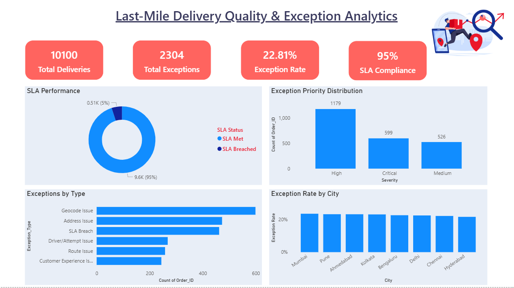

#  Last-Mile Delivery Quality & Exception Analytics


A data quality and operational analytics project that simulates a
last-mile delivery monitoring workflow using **Python, SQL, SQLite and Power BI**.

The project audits delivery records, detects operational exceptions,
classifies their severity, recommends corrective actions, performs SQL-based
analysis, and presents key findings through an interactive Power BI dashboard.

---

##  Dashboard Preview



### Dashboard KPIs

| KPI | Result |
|---|---:|
| Total Deliveries | **10,100** |
| Total Exceptions | **2,304** |
| Exception Rate | **22.81%** |
| SLA Compliance | **95.00%** |

---

##  Business Problem

Last-mile delivery operations generate large volumes of transactional and
operational data.

Operations and quality teams need to identify:

- Address and geocoding problems
- SLA breaches
- Excessive delivery attempts
- Route anomalies
- Customer experience issues
- High-priority operational exceptions
- City-level quality differences
- Recurring operational patterns

This project simulates a data-driven quality monitoring workflow to identify
these issues and prioritize corrective action.

---

##  Tools & Technologies

- **Python**
- **Pandas**
- **NumPy**
- **SQL**
- **SQLite**
- **Power BI**
- **Git & GitHub**

---

##  Project Workflow

```text
Raw Delivery Data
        ↓
Data Quality Audit
        ↓
Exception Detection
        ↓
Exception Classification
        ↓
Severity Assignment
        ↓
Recommended Action
        ↓
SQLite Database
        ↓
SQL Analysis
        ↓
Power BI Dashboard


---

##  *Dataset*

The project uses a synthetic last-mile delivery dataset containing:

10,100 delivery records
14 original attributes
Driver information
Delivery information
Geographic information
SLA information
Customer ratings
Address quality
Route status

Additional analytical fields are generated during the quality-audit process.
